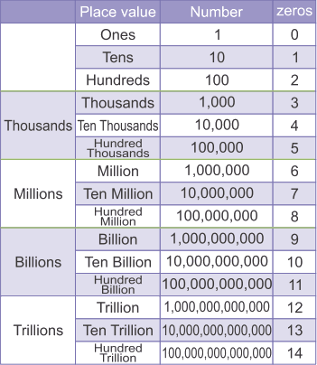

# Số đếm - Cardinal Numerals


Một [số đếm](<https://en.wikipedia.org/wiki/Cardinal_number_(linguistics)>) là một danh từ đơn dùng để đếm, ví dụ **một**, **hai**, **ba**, hoặc một cụm danh từ dùng để đếm, ví dụ **ba trăm bốn mươi hai** trong tiếng Việt.

Hãy tạo file `cardinal_numeral.py`. Bạn sẽ viết các hàm (functions) của nhiệm vụ này vào trong file `cardinal_numeral.py` đã tạo.

# Waypoint 1: Viết số đếm bằng tiếng Việt

Viết hàm `integer_to_vietnamese_numeral` nhận đối số bằng tham số `n` là một số nguyên dương, và trả về chuỗi tương ứng với [số đếm bằng tiếng Việt](https://en.wikipedia.org/wiki/Vietnamese_numerals) theo kiểu **miền Bắc** của số đó.

Hàm sẽ báo ngoại lệ (exception) `TypeError` nếu `n` không phải số nguyên.

Hàm sẽ báo ngoại lệ (exception) `ValueError` nếu `n` không phải số nguyên dương.

Số nguyên lớn nhất mà hàm có thể đọc là `999,999,999,999`. Nếu `n` lớn hơn số này, hàm sẽ báo ngoại lệ `OverflowError`.

Ví dụ:

```python
>>> integer_to_vietnamese_numeral(96)
'chín mươi sáu'
>>> integer_to_vietnamese_numeral(405)
'bốn trăm linh năm'
>>> integer_to_vietnamese_numeral(1915)
'một nghìn chín trăm mười lăm'
>>> integer_to_vietnamese_numeral(5061)
'năm nghìn không trăm sáu mươi mốt'
>>> integer_to_vietnamese_numeral(1002003)
'một triệu không trăm linh hai nghìn không trăm linh ba'
>>> integer_to_vietnamese_numeral(1000000)
'một triệu'
>>> integer_to_vietnamese_numeral(1030000)
'một triệu không trăm ba mươi nghìn'
>>> integer_to_vietnamese_numeral(1002003004)
'một tỷ không trăm linh hai triệu không trăm linh ba nghìn không trăm linh bốn'
>>> integer_to_vietnamese_numeral(1000003004)
'một tỷ không trăm linh ba nghìn không trăm linh bốn'
>>> integer_to_vietnamese_numeral(1002000004)
'một tỷ không trăm linh hai triệu không trăm linh bốn'
>>> integer_to_vietnamese_numeral(100000004)
'một trăm triệu không trăm linh bốn'
>>> integer_to_vietnamese_numeral(999999999999)
'chín trăm chín mươi chín tỷ chín trăm chín mươi chín triệu chín trăm chín mươi chín nghìn chín trăm chín mươi chín'
>>> integer_to_vietnamese_numberal('9999999999990')
Traceback (most recent call last):
  File "<input>", line 1, in <module>
  File "<input>", line 4, in _integer_to_vietnamese_numeral
OverflowError: Integer greater than 999,999,999,999
>>> integer_to_vietnamese_numberal('4096')
Traceback (most recent call last):
  File "<input>", line 1, in <module>
  File "<input>", line 3, in _integer_to_vietnamese_numeral
TypeError: Not an integer
>>> integer_to_vietnamese_numeral(-1)
Traceback (most recent call last):
  File "<input>", line 1, in <module>
  File "<input>", line 6, in _integer_to_vietnamese_numeral
ValueError: Not a positive integer
```

_Gợi ý: Nếu bạn chưa hình dung được nên bắt đầu thế nào, hãy xem thử [hệ thống số đếm quốc tế](https://www.youtube.com/watch?v=jKo_NrYcAaA), đây là hệ thống được đa số các nước sử dụng, gồm cả Việt Nam. Theo hệ thống này, một số sẽ được chia tách thành nhiều nhóm nhỏ (periods), và các nhóm đều tuân theo cùng một quy tắc._



# Waypoint 2: Số đếm tiếng Việt kiểu miền Nam

Nếu trong cách đếm số ở miền Bắc, người ta dùng chữ "nghìn" và "linh", thì ở miền Nam người ta dùng "ngàn" và "lẻ".

Hãy thêm vào hàm `integer_to_vietnamese_numeral` một [tham số có đối số tùy chọn (optional argument)](http://www.yourownlinux.com/2016/12/python-function-keyword-defaults-optional-arguments.html) `region` (kiểu chuỗi) có thể truyền vào một trong hai giá trị sau (kiểu chuỗi):

- `'north'`: kiểu miền Bắc Việt Nam
- `'south'`: kiểu miền Nam Việt Nam

Giá trị mặc định của `region` là `north`. Nếu đối số truyền vào `region` có giá trị `None`, mặc định sẽ trở về giá trị `north`.

Nếu đối số truyền vào `region` giá trị khác `None` và không phải là chuỗi, hàm `integer_to_vietnamese_numeral` sẽ báo ngoại lệ `TypeError`.

Nếu đối số truyền vào `region` khác `None` và không phải là một trong hai giá trị `'north'` và `'south'`, hàm `integer_to_vietnamese_numeral` sẽ báo ngoại lệ `ValueError`.

Ví dụ:

```python
>>> integer_to_vietnamese_numeral(405)
'bốn trăm linh năm'
>>> integer_to_vietnamese_numeral(405, region='south')
'bốn trăm lẻ năm'
>>> integer_to_vietnamese_numeral(1971, region='north')
'một nghìn chín trăm bảy mươi mốt'
>>> integer_to_vietnamese_numeral(1971, region='south')
'một ngàn chín trăm bảy mươi mốt'
>>> integer_to_vietnamese_numeral(1, region=0)
Traceback (most recent call last):
  File "<input>", line 1, in <module>
  File "<input>", line 3, in _integer_to_vietnamese_numeral
TypeError: Argument "region" is not a string
>>> integer_to_vietnamese_numeral(1, region='whatever')
Traceback (most recent call last):
  File "<input>", line 1, in <module>
  File "<input>", line 6, in _integer_to_vietnamese_numeral
ValueError: Argument "region" has not a correct value
```

# Waypoint 3: Đọc số bằng tiếng Việt

Bây giờ, ta muốn hàm `integer_to_vietnamese_numeral` đọc thành tiếng số đếm mà nó đã tạo ra từ `n` bằng tiếng Việt. Tính năng này gọi là [text-to-speech (TTS)](https://en.wikipedia.org/wiki/Speech_synthesis). Hiện nay, text-to-speech [rất thường được sử dụng trên điện thoại di động](https://www.youtube.com/watch?v=-gTn4Q-9Lk8).

Cách tổng hợp âm để đọc thành tiếng các số đếm bằng tiếng Việt thực ra không phức tạp. Hàm `integer_to_vietnamese_numeral` sẽ lần lượt đọc thành tiếng từng chữ số trong số mà nó đã tạo ra từ `n`.

Trong thư mục `./sounds/vie/north` đã có sẵn một số files âm thanh tương ứng với cách đếm số trong tiếng Việt:

```bash
$ ls -la ./sounds/vie/north
total 152
drwxr-xr-x  21 dcaune  staff   672 Jun 24 10:25 .
drwxr-xr-x   5 dcaune  staff   160 May 27 08:52 ..
-rw-r--r--@  1 dcaune  staff  2496 Jun 24 08:52 ba.mp3
-rw-r--r--@  1 dcaune  staff  2784 Jun 24 08:54 bảy.mp3
-rw-r--r--@  1 dcaune  staff  2784 Jun 24 08:53 bốn.mp3
-rw-r--r--@  1 dcaune  staff  2880 Jun 24 08:55 chín.mp3
-rw-r--r--@  1 dcaune  staff  2880 Jun 24 08:52 hai.mp3
-rw-r--r--@  1 dcaune  staff  2688 Jun 24 10:24 không.mp3
-rw-r--r--@  1 dcaune  staff  2304 Jun 24 08:54 lăm.mp3
-rw-r--r--@  1 dcaune  staff  2112 Jun 24 08:52 mốt.mp3
-rw-r--r--@  1 dcaune  staff  2016 Jun 24 08:51 một.mp3
-rw-r--r--@  1 dcaune  staff  2976 Jun 24 08:56 mươi.mp3
-rw-r--r--@  1 dcaune  staff  2976 Jun 24 08:56 mười.mp3
-rw-r--r--@  1 dcaune  staff  2304 Jun 24 08:53 năm.mp3
-rw-r--r--@  1 dcaune  staff  2592 Jun 24 08:57 ngàn.mp3
-rw-r--r--@  1 dcaune  staff  2400 Jun 24 08:57 nghìn.mp3
-rw-r--r--@  1 dcaune  staff  3264 Jun 24 08:54 sáu.mp3
-rw-r--r--@  1 dcaune  staff  2592 Jun 24 08:55 tám.mp3
-rw-r--r--@  1 dcaune  staff  2496 Jun 24 08:57 trăm.mp3
-rw-r--r--@  1 dcaune  staff  2688 Jun 24 08:58 triệu.mp3
-rw-r--r--@  1 dcaune  staff  2208 Jun 24 08:58 tỷ.mp3
```

Ví dụ, số `128` trong tiếng Việt đọc là "một trăm hai mươi tám". Nếu ta truyền giá trị `128` vào `n`, hàm `integer_to_vietnamese_numeral` sẽ cần phát các files âm thanh sau theo đúng thứ tự như dưới đây:

1. `một.mp3`
1. `trăm.mp3`
1. `hai.mp3`
1. `mươi.mp3`
1. `tám.mp3`

Hãy cập nhật hàm `integer_to_vietnamese_numeral` bằng cách thêm vào optional argument `activate_tts` (kiểu boolean), với giá trị mặc định là `False`.

Nếu `activacte_tts` được truyền vào giá trị `None`, mặc định sẽ trở về giá trị `False`.

Nếu `activate_tts` được truyền vào giá trị `True`, hàm sẽ đọc thành tiếng số đếm tiếng Việt mà nó đã tạo ra từ `n`, và in ra cách đọc số đếm đó. Nếu `activate_tts` được truyền vào giá trị `False`, nó chỉ in cách đọc số nhưng không đọc thành tiếng.

Nếu giá trị truyền vào `activate_tts` khác `None` và không phải kiểu boolean, hàm `integer_to_vietnamese_numeral` sẽ báo ngoại lệ `TypeError`.

Ví dụ:

```python
>>> integer_to_vietnamese_numeral(405, activate_tts=True)
'bốn trăm linh năm'
>>> integer_to_vietnamese_numeral(405, region='south', activate_tts=True)
'bốn trăm lẻ năm'
>>> integer_to_vietnamese_numeral(1971, activate_tts=True, region='north')
'một nghìn chín trăm bảy mươi mốt'
>>> integer_to_vietnamese_numeral(1971, region='south', activate_tts=True)
'một ngàn chín trăm bảy mươi mốt'
>>> integer_to_vietnamese_numeral(1, activate_tts=1)
Traceback (most recent call last):
  File "<input>", line 1, in <module>
  File "<input>", line 3, in _integer_to_vietnamese_numeral
TypeError: Argument "activate_tts" is not a boolean
```

# Waypoint 4: Đọc số bằng tiếng Việt với giọng miền Nam

Các files âm thanh trong thư mục `./sounds/vie` tương ứng với cách phát âm và đọc số giọng miền Bắc. Giờ ta muốn hàm có thể đọc cả giọng miền Nam.

Nếu giá trị truyền vào `region` là `'north'`, hàm `integer_to_vietnamese_numeral` sẽ đọc số bằng giọng miền Bắc; nếu giá trị truyền vào `region` là `'south'`, nó sẽ đọc số bằng giọng miền Nam.

Tuy nhiên, các files âm thanh giọng miền Nam không có sẵn. Bạn hãy tự ghi âm để tạo các files cần thiết nhé. Hẳn là bạn đang dùng một chiếc điện thoại Android hoặc iPhone? Hãy lên cửa hàng ứng dụng trực tuyến, bạn sẽ dễ dàng tìm thấy một phần mềm ghi âm miễn phí.

# Waypoint 5: Viết số đếm bằng tiếng Anh

Hãy viết hàm `integer_to_english_numeral` nhận đối số bằng tham số `n` là một số nguyên dương, và trả về chuỗi tương ứng với [số đếm bằng tiếng Anh](https://en.wikipedia.org/wiki/English_numerals) của số đó.

Hàm sẽ báo ngoại lệ `TypeError` nếu `n` không phải số nguyên.

Hàm sẽ báo ngoại lệ `ValueError` nếu `n` không phải số nguyên dương.

Ví dụ:

```python
>>> integer_to_english_numeral(96)
'ninety-six'
>>> integer_to_english_numeral(101)
'one hundred and one'
>>> integer_to_english_numeral(405)
'four hundred and five'
>>> integer_to_english_numeral(1971)
'one thousand and nine hundred and seventy-one'
>>> integer_to_english_numeral(5061)
'five thousand and sixty-one'
>>> integer_to_english_numeral('4096')
Traceback (most recent call last):
  File "<input>", line 1, in <module>
  File "<input>", line 3, in _integer_to_english_numeral
TypeError: Not an integer
>>> integer_to_english_numeral(-1)
Traceback (most recent call last):
  File "<input>", line 1, in <module>
  File "<input>", line 6, in _integer_to_english_numeral
ValueError: Not a positive integer
```

_Lưu ý: Bạn có thể kiểm tra xem kết quả trả về của hàm `integer_to_english_numeral` có chính xác hay không bằng các công cụ [online generators](https://www.ego4u.com/en/cram-up/vocabulary/numbers/generator)._

# Waypoint 6: Đọc số đếm bằng tiếng Anh

Bây giờ ta muốn hàm `integer_to_english_numeral` cũng đọc thành tiếng số đếm mà nó đã tạo ra từ `n` bằng tiếng Anh! 😁

Hãy cập nhật hàm `integer_to_english_numeral` bằng cách thêm vào optional argument `activate_tts` (kiểu boolean), với giá trị mặc định là `False`. Nếu `activate_tts` được truyền vào giá trị `None`, mặc định sẽ trở về `False`.

Nếu `activate_tts` được truyền vào giá trị `True`, hàm sẽ đọc thành tiếng số đếm mà nó đã tạo ra từ `n` bằng tiếng Anh, và in ra cách đọc số đếm đó theo tiếng Anh. Nếu `activate_tts` được truyền vào giá trị `False`, nó chỉ in cách đọc số nhưng không đọc thành tiếng.

Nếu giá trị truyền vào `activate_tts` khác `None` và không phải boolean, hàm sẽ báo ngoại lệ `TypeError`.

Vậy các files âm thanh số đếm bằng tiếng Anh đang ở đâu? Bạn thử đoán xem..., bạn cũng sẽ tự ghi âm nhé, và lưu chúng vào thư mục `./sounds/eng`...

Like a pro - thật chuyên nghiệp! 😈😎
